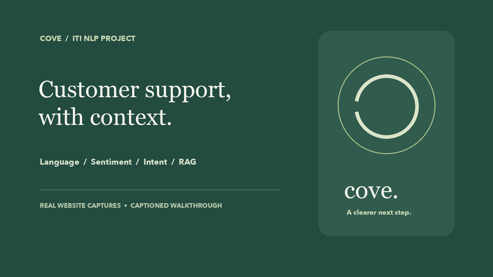
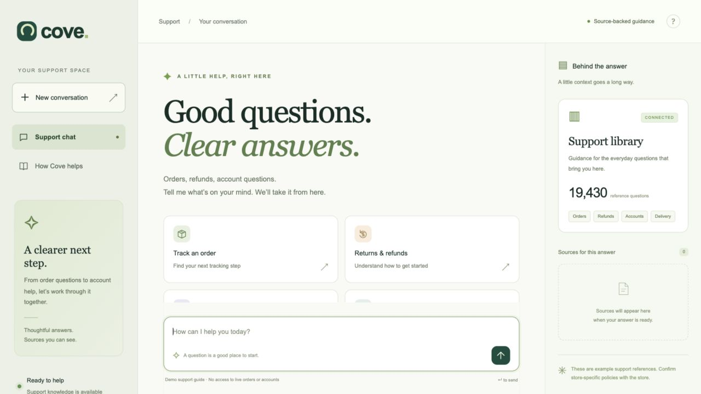
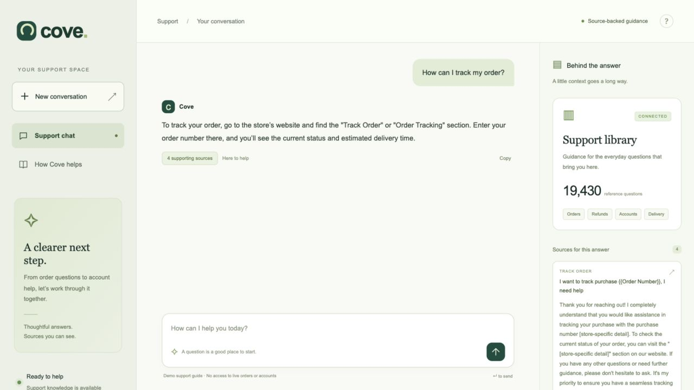
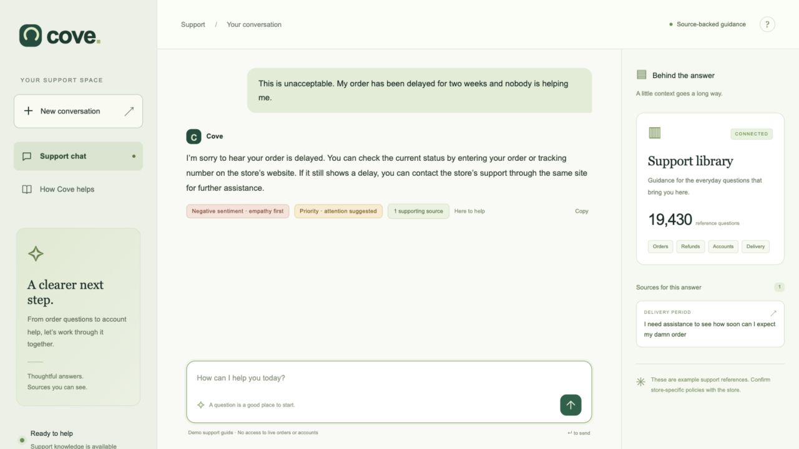
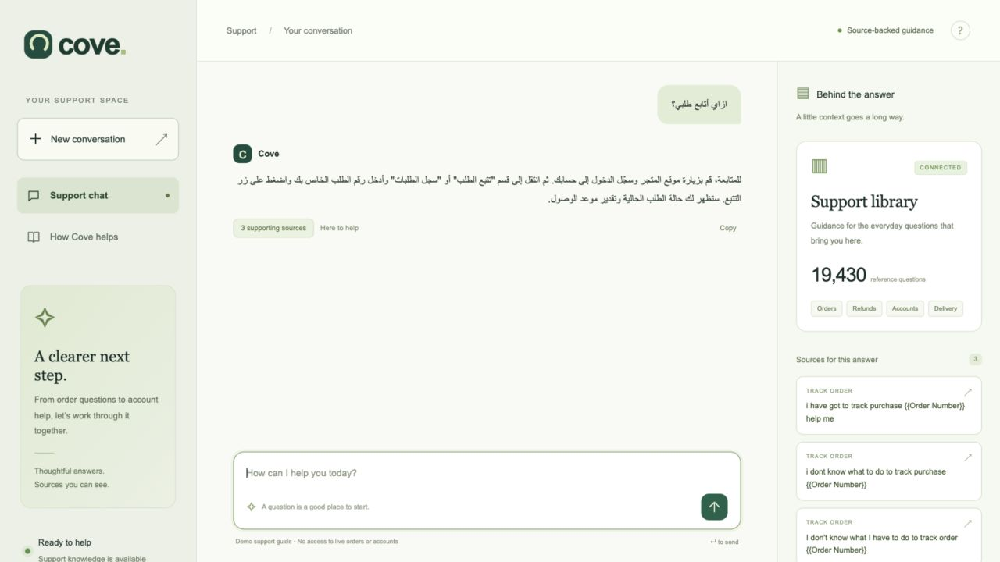
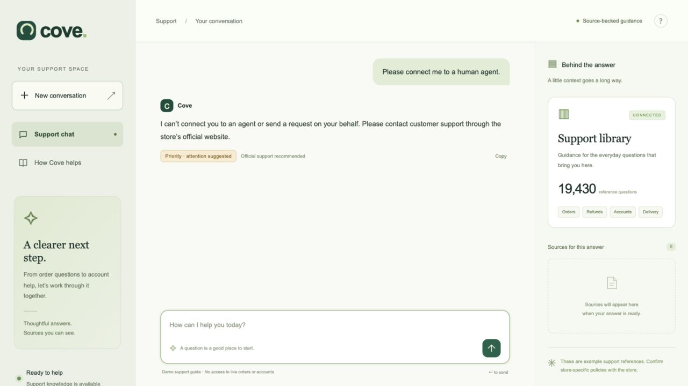
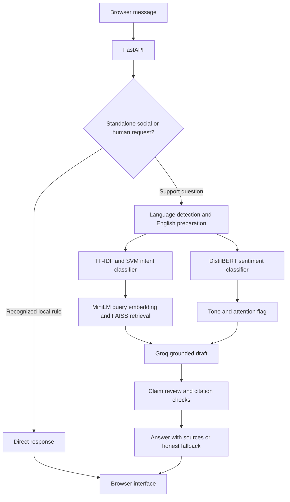

<p align="center">
  
</p>

<p align="center"><strong>Language-aware. Emotion-aware. Grounded in retrieved support examples.</strong></p>
<p align="center">Python · FastAPI · scikit-learn · Transformers · Sentence Transformers · FAISS · Groq</p>
<p align="center"><a href="#demo">Demo</a> · <a href="#how-it-works">How it works</a> · <a href="#results">Results</a> · <a href="#run-locally">Run locally</a> · <a href="#notebooks">Notebooks</a></p>

Cove is an educational customer-support chatbot that combines three trained classifiers with retrieval-augmented generation. It answers common order, delivery, refund and account questions, shows the references behind its guidance, and adjusts its tone when negative sentiment is detected confidently.

It is a **support guide**: it has no access to live orders or accounts and cannot issue refunds, submit reviews, or connect users to a human agent.

## Demo

[**Watch or download the 1:40 demo →**](docs/demo/Cove_Website_Demo.mp4)

The 1080p video contains real website interactions, chapter titles and captions. It is silent. It includes an honest fallback on a follow-up question; it is not a claim that every response succeeds. [Recording notes](docs/demo/DEMO_NOTES.md) · [Editable captions](docs/demo/Cove_Demo_Captions.srt)



## What Cove does

- **Identifies language:** a traditional classifier recognizes 20 languages. Non-English questions are translated before the English-only classifiers and retrieval run.
- **Recognizes intent:** a TF-IDF/SVM model predicts 27 support intents, grouped into practical handling routes.
- **Adjusts response tone:** DistilBERT predicts happy, neutral or sad sentiment. Uncertain predictions use neutral wording.
- **Retrieves relevant examples:** MiniLM embeddings and FAISS search 19,430 support question/response pairs.
- **Shows sources:** answers can include expandable supporting references.
- **States its limits:** no invented transfers or completed transactions; unsupported drafts can fall back to an honest limitation message.

<table>
<tr><td width="50%"><strong>References behind an answer</strong><br></td><td width="50%"><strong>Empathy and attention flags</strong><br></td></tr>
<tr><td><strong>Arabic support</strong><br></td><td><strong>Honest human-support boundaries</strong><br></td></tr>
</table>

## How it works



English emotion classification uses the original wording. For other languages, a faithful translation is kept separate from the search-query rewrite so that emotional wording is not intentionally discarded. Strong intent predictions give matching references a small ranking boost rather than excluding all other intents.

The retrieved question/response pairs become context for GPT-OSS 20B. The LLM is **not fine-tuned on the knowledge base**. A second model call checks for unsupported claims and action promises; source IDs are also validated in code. This review adds latency and can itself make mistakes.

## Results

| Component | Method | Recorded result |
|---|---|---|
| Language | Character TF-IDF + Logistic Regression | 99.39% test accuracy |
| Intent | Word TF-IDF + Linear SVM | 99.71% test accuracy; 99.70% macro-F1 |
| Emotion | Fine-tuned DistilBERT | 68.42% test accuracy; 68.37% macro-F1 |
| Retrieval | MiniLM + FAISS | Same-intent hit@5: 100% on 135 sampled test queries |

**Retrieval hit rate is not answer accuracy.** The retrieval metric checks topic alignment, not whether a generated response is factually correct. The classifier scores are benchmark results, not guarantees for real customer messages.

Nine offline regression tests passed during integration. Fifteen live HTTP scenarios were recorded; an Arabic complaint triggered a fallback after unrelated cancellation advice was rejected. These are development checks, not an independent benchmark. See [verification notes](PDF_ALIGNMENT.md), [saved responses](reports/rag/generation_checks.json), and the module reports.

## Run locally

The recorded setup used **Python 3.12 on an Intel Mac**. Other operating systems and hardware may need compatible dependency versions. No Colab session or GPU is required for inference.

### 1. Install the application dependencies

Open a terminal in the repository:

```bash
python3.12 -m venv .venv-rag
.venv-rag/bin/python -m pip install -r requirements-rag-lock.txt
```

### 2. Restore the trained artifacts

The source repository intentionally excludes model weights and the generated vector index. A source checkout alone cannot start the complete chatbot.

Obtain the separate **Cove_Runtime_Artifacts.zip** from the project owner, then run:

```bash
.venv-rag/bin/python scripts/restore_artifacts.py /path/to/Cove_Runtime_Artifacts.zip
```

The importer verifies checksums and restores `models/language`, `models/intent`, `models/emotion`, `models/embedding` and `models/rag`. It refuses to overwrite an existing model directory. Only load artifacts from a trusted source; the classical models use joblib/pickle.

There is no hosted artifact download URL yet. The archive is prepared separately for distribution; the README will need a release link after it is uploaded. [Artifact details](docs/ARTIFACTS.md)

### 3. Configure Groq privately

```bash
cp .env.example .env
```

Open `.env` locally and set `GROQ_API_KEY`. Never commit it. The browser does not receive the saved key. Internet access is required for hosted generation and translation; the classifier and retrieval models run locally.

### 4. Start Cove

```bash
.venv-rag/bin/python -m uvicorn app.main:app --host 127.0.0.1 --port 8000
```

Visit **http://127.0.0.1:8000/** and keep the terminal running. On macOS, `Start Cove.command` is a shortcut after setup. If the browser reports a refused connection, check that the server is still running.

This is a local application with no production authentication. Its supported deployment binds to loopback.

## Notebooks

| Notebook | Purpose | Environment |
|---|---|---|
| [01 — Language detection](notebooks/01_language_detection.ipynb) | Audit and evaluate the imported language model | Local classifier environment |
| [02 — Emotion classification](notebooks/02_emotion_classifier.ipynb) | DistilBERT fine-tuning and evaluation | Original executed Colab experiment |
| [03 — Intent classification](notebooks/03_intent_classifier.ipynb) | Compare classical models and export the selected SVM | Original executed training experiment |
| [04 — RAG chatbot](notebooks/04_rag_chatbot.ipynb) | Retrieval, saved live responses and local deployment | `.venv-rag` |

The [original language-training notebook](notebooks/reference/Language_Detection_colab_original.ipynb) is retained for provenance. Saved notebook outputs describe the recorded runs; package cleanup does not represent a new training run. Personal machine paths have been replaced with placeholders in recorded outputs. Dataset and test metrics have not been changed.

To repeat experiments, follow each notebook's environment requirements. Do not rerun training merely to launch the application.

## Testing

```bash
# Offline routing and safeguard regression checks
.venv-rag/bin/python -m unittest discover -s tests -v

# Retrieval checks against the saved partitions
.venv-rag/bin/python scripts/evaluate_rag.py

# Live scenarios against a running app; consumes Groq quota
.venv-rag/bin/python scripts/check_running_app.py
```

Live calls are paced to reduce free-tier rate limiting. Outputs may vary. Rebuilding the index uses the saved intent training partition and downloads the pinned Bitext dataset if it is not cached:

```bash
.venv-rag/bin/python scripts/build_rag_index.py --force
```

## Datasets and limitations

- **Language:** [papluca/language-identification](https://huggingface.co/datasets/papluca/language-identification).
- **Emotion:** [TweetEval sentiment](https://huggingface.co/datasets/cardiffnlp/tweet_eval). Happy/neutral/sad mean positive/neutral/negative, including frustration in the negative class.
- **Intent and knowledge base:** [Bitext customer-support dataset](https://huggingface.co/datasets/bitext/Bitext-customer-support-llm-chatbot-training-dataset).
- **Embeddings:** [all-MiniLM-L6-v2](https://huggingface.co/sentence-transformers/all-MiniLM-L6-v2).
- **Emotion backbone:** [DistilBERT base uncased](https://huggingface.co/distilbert/distilbert-base-uncased).

The assignment names `dair-ai/emotion`, but its listed labels do not include a genuine neutral class. This implementation uses TweetEval sentiment instead. That substitution is documented and still requires instructor acceptance. The separate requested emotion accuracy in the 90s has **not** been achieved.

Bitext examples are synthetic, not verified store policies. Translation, intent classification, sentiment classification and generation can all fail. Confidence scores are uncalibrated; the emotion threshold of 0.9 reduces assertions on uncertain messages but does not guarantee correctness. An attention flag is not a human escalation. Near-paraphrases may remain across partitions despite duplicate controls.

Dataset and model rights remain with their respective providers; retain their notices and review their terms before redistribution or use beyond this educational project.

## Project layout

```text
app/                 FastAPI server and browser interface
src/                 Classifier loaders and RAG pipeline
notebooks/           Executed module notebooks and training reference
scripts/             Artifact restoration, evaluation and preparation
reports/             Recorded metrics, plots, partitions and behavior checks
docs/screenshots/    Screenshots from the real demo
docs/demo/           MP4, captions and recording notes
models/              Local runtime artifacts; excluded from Git
```

## Development and provenance

AI coding assistance contributed to implementation, debugging and documentation. Reported metrics come from the preserved experiments, and limitations are documented rather than replaced with invented results. The project should be presented in accordance with the course's assistance and attribution requirements.
